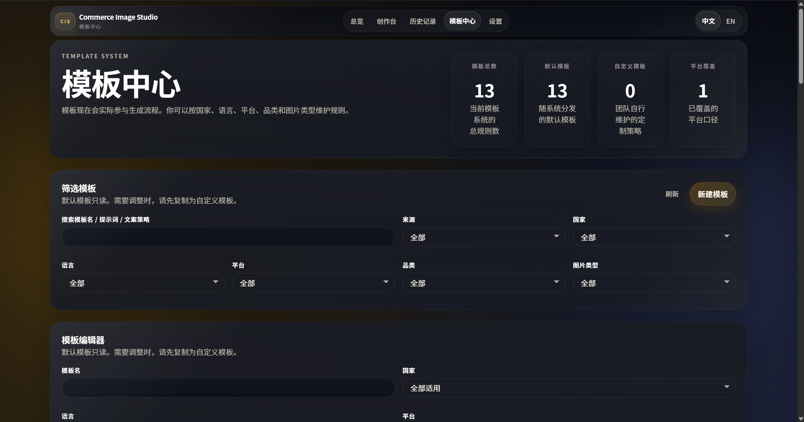
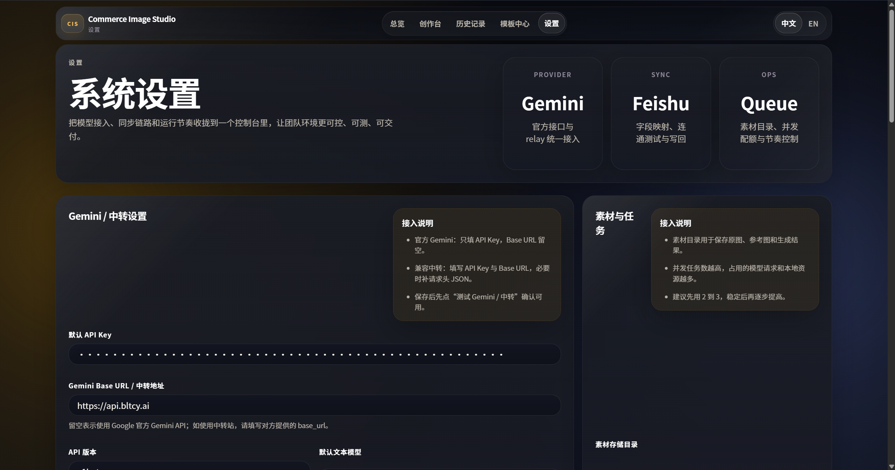
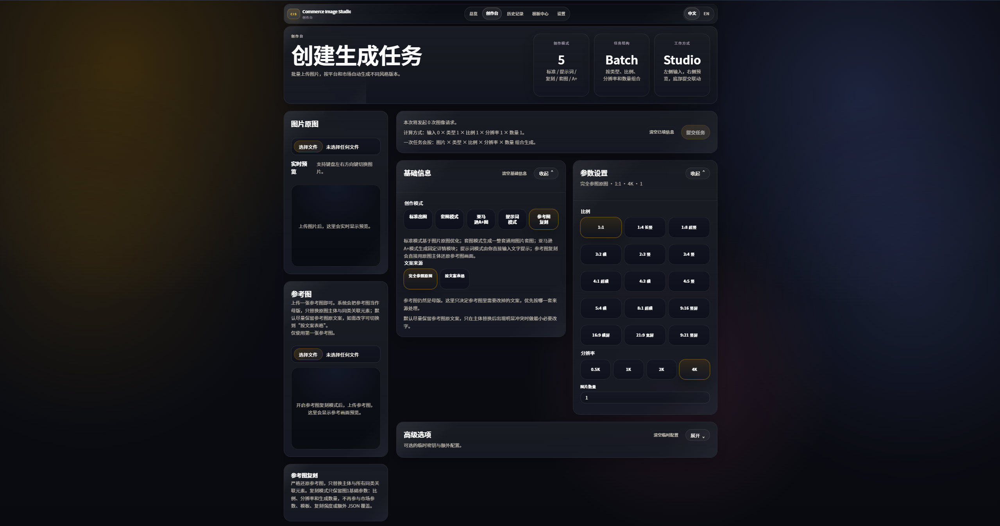

# Picture-creation

对应对象：`Picture-creation`

> 一个面向电商团队的本地化 AI 生图工作台，支持多图联合生成、批量套模板、审核导出、模板复用与 Windows 安装交付。

| 版本 | 默认文本模型 | 默认图片模型 | GitHub |
| --- | --- | --- | --- |
| `v0.7.0` | `gemini-3.1-flash-lite-preview` | `gemini-3.1-flash-image-preview` | [aEboli/Picture-creation](https://github.com/aEboli/Picture-creation) |

## 界面预览

| 总览页 | 创作台 | 历史记录 |
| --- | --- | --- |
|  |  |  |

| 模板中心 | 设置页 | 参考图复刻 |
| --- | --- | --- |
|  |  |  |

## 核心能力

| 输入组织 | 生成能力 | 协作与交付 |
| --- | --- | --- |
| 多图联合、批量套模板、纯提示词、参考图复刻 | 标准模式、套图模式、亚马逊 A+ 图模式、提示词模式、参考图复刻 | 历史记录、审核导出、模板中心、品牌库、飞书同步、Windows 安装器 |

| 输出控制 | 分发形态 | 数据兼容 |
| --- | --- | --- |
| 比例、分辨率、套图数量、语种与平台参数 | 绿色包、ZIP、IExpress 安装包、Inno 安装器 | 兼容旧 `Commerce-Image-Studio` 数据目录与数据库文件 |

## v0.7.0 重点

- 全量品牌重命名为 `Picture-creation`，统一应用名、发布包、安装器与文档入口。
- 默认工作流改为 Gemini 3.1：文本 `gemini-3.1-flash-lite-preview`，图片 `gemini-3.1-flash-image-preview`。
- 五种创建模式统一支持 `多图联合 / 批量套模板` 两种输入语义。
- README、使用说明、PRD、版本说明按交付视角重写，并纳入最新界面截图。
- Windows 发布脚本统一输出 `picture-creation` 系列产物，并保留旧数据目录兼容能力。

## 发布产物

| 类型 | 文件/目录 |
| --- | --- |
| Inno 安装器 | `PICTURE-CREATION-WINDOWS-0.7.0.exe` |
| 绿色发布目录 | `release/picture-creation` |
| 绿色发布压缩包 | `release/picture-creation.zip` |
| 安全发布压缩包 | `release/picture-creation-safe.zip` |
| 安装包目录 | `release/picture-creation-safe-installer` |

## 文档导航

- [使用说明-Picture-creation](./Readme/%E4%BD%BF%E7%94%A8%E8%AF%B4%E6%98%8E-Picture-creation.md)
- [PRD-Picture-creation](./Readme/PRD-Picture-creation.md)
- [版本说明-v0.7.0](./Readme/%E7%89%88%E6%9C%AC%E8%AF%B4%E6%98%8E-v0.7.0.md)
- [使用说明-多图联合生成语义](./Readme/%E4%BD%BF%E7%94%A8%E8%AF%B4%E6%98%8E-%E5%A4%9A%E5%9B%BE%E8%81%94%E5%90%88%E7%94%9F%E6%88%90%E8%AF%AD%E4%B9%89.md)
- [PRD-多图联合生成语义](./Readme/PRD-%E5%A4%9A%E5%9B%BE%E8%81%94%E5%90%88%E7%94%9F%E6%88%90%E8%AF%AD%E4%B9%89.md)
- [历史版本说明-v0.6.0](./Readme/%E7%89%88%E6%9C%AC%E8%AF%B4%E6%98%8E-v0.6.0.md)

## 本地开发

```bash
npm install
npm run typecheck
npm run build
npm run package:release:safe:zip
npm run package:installer:exe:safe
```

## 兼容说明

- 新默认数据目录：`%LOCALAPPDATA%\Picture-creation\data`
- 旧目录 `Commerce-Image-Studio` 与旧数据库名 `commerce-image-studio.sqlite` 仍可自动识别
- 旧环境变量 `COMMERCE_STUDIO_*` 仍兼容；新发布脚本优先写入 `PICTURE_CREATION_*`
