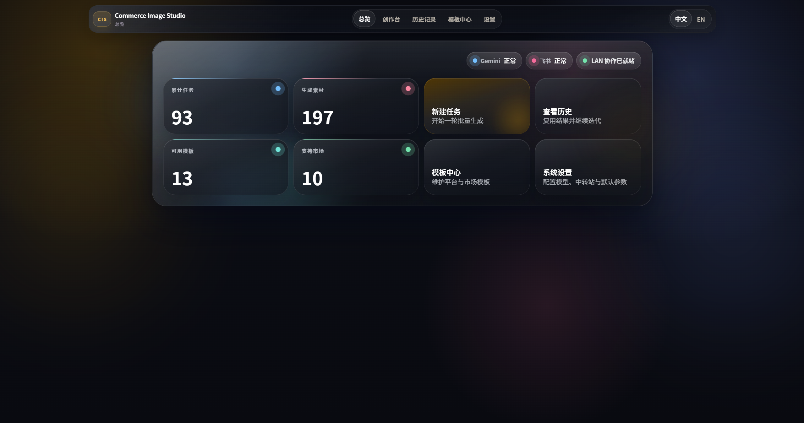
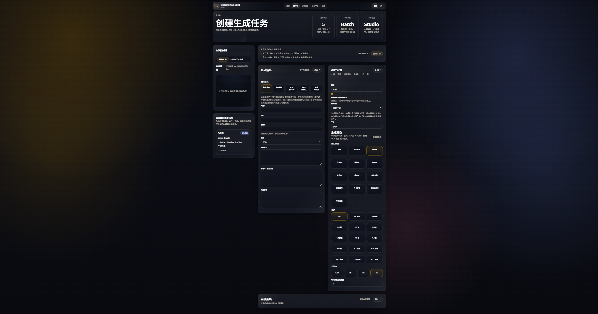

# Picture-creation

对应对象：`Picture-creation`

> 一个面向电商团队的本地化 AI 生图工作台，支持多模式创作、浏览器本地 API 配置、图型提示词调校、历史审核、品牌规则管理、飞书同步与 Windows 安装交付。

源码目录：[`Picture-creation-main/`](./Picture-creation-main/)

| 版本 | 默认文本模型 | 默认图片模型 | GitHub |
| --- | --- | --- | --- |
| `v0.9.0` | `gemini-3.1-flash-lite-preview` | `gemini-3.1-flash-image-preview` | [aEboli/Picture-creation](https://github.com/aEboli/Picture-creation) |

## 界面预览

> 当前截图资产沿用 `v0.8.0` 归档目录；`v0.9.0` 的主要更新集中在配置链路、提示词策略和创作台交互稳定性。

| 总览页 | 创作台 | 历史记录 |
| --- | --- | --- |
|  |  |  |

| 设置中心 | 标准模式 | 参考图复刻 |
| --- | --- | --- |
|  |  |  |

## 核心能力

| 输入组织 | 生成能力 | 协作与交付 |
| --- | --- | --- |
| 多图联合、批量套模板、纯提示词、参考图复刻 | 标准模式、套图模式、亚马逊 A+ 图模式、提示词模式、参考图复刻 | 历史记录、审核导出、品牌库、飞书同步、Windows 安装器 |

| 配置方式 | 提示词控制 | 数据兼容 |
| --- | --- | --- |
| 浏览器本地 API Key、共享文本模型、侧栏 API/飞书快捷配置 | 标准 / 套图 / 亚马逊 A+ 三类图型提示词可在设置页折叠编辑 | 兼容旧 `Commerce-Image-Studio` 数据目录与数据库文件 |

## v0.9.0 重点

- 创建页生成请求现在会读取浏览器本地 API 设置，并以 `temporaryProvider` 传给后端；API Key 不再要求写入服务端数据库后才能生成。
- 创建页智能体复用同一套浏览器 API Key 和文本模型配置；OpenAI 兼容 provider 会走 Responses API，并明确使用文本模型字段。
- 设置页新增“生图类型提示词”折叠面板，覆盖标准模式、套图模式和亚马逊 A+ 模式的图型级提示词规则。
- 图型提示词会进入 Gemini 与 OpenAI 两条 provider 的结构化生成提示词链路，用于增强主图、场景图、A+ 模块等输出差异。
- 侧栏 API 与飞书状态胶囊可直接打开对应单区块快捷配置抽屉，减少从状态检查到修复配置的跳转成本。
- 创建页默认市场参数固定回到美国 / 英文 / Amazon，不再因为中文界面自动切到中国 / 天猫。
- 创作台参数区已恢复到同一工作台表面，输出比例、分辨率和图型选择仍保持在主流程内可见。
- 服务测试成功后会同步写入浏览器本地 API 设置，后续生成与智能体调用能直接复用刚测试通过的配置。

## 当前产品口径

- 主导航保持为 `总览 / 创作台 / 历史记录 / 设置 / 品牌库`。
- `/templates` 旧模板中心已退役，不再作为可见导航入口。
- 创建页智能体为轻量辅助入口，用于图片分析、提示词建议和表单字段回填。
- 设置页与品牌库已分离，设置页负责运行配置、飞书同步、素材目录和图型提示词。
- 浏览器 API 设置优先服务当前用户和当前浏览器，不会被公开发布包默认携带。

## 发布产物

| 类型 | 文件/目录 |
| --- | --- |
| Inno 安装器 | `PICTURE-CREATION-WINDOWS-0.9.0.exe` |
| 绿色发布目录 | `Picture-creation-main/release/picture-creation` |
| 绿色发布压缩包 | `Picture-creation-main/release/picture-creation.zip` |
| 安全发布压缩包 | `Picture-creation-main/release/picture-creation-safe.zip` |
| 安装包目录 | `Picture-creation-main/release/picture-creation-safe-installer` |

## 文档导航

- [使用说明-Picture-creation](./Picture-creation-main/Readme/%E4%BD%BF%E7%94%A8%E8%AF%B4%E6%98%8E-Picture-creation.md)
- [PRD-Picture-creation](./Picture-creation-main/Readme/PRD-Picture-creation.md)
- [版本说明-v0.9.0](./Picture-creation-main/Readme/%E7%89%88%E6%9C%AC%E8%AF%B4%E6%98%8E-v0.9.0.md)
- [历史版本说明-v0.8.0](./Picture-creation-main/Readme/%E7%89%88%E6%9C%AC%E8%AF%B4%E6%98%8E-v0.8.0.md)
- [历史版本说明-v0.7.0](./Picture-creation-main/Readme/%E7%89%88%E6%9C%AC%E8%AF%B4%E6%98%8E-v0.7.0.md)
- [使用说明-多图联合生成语义](./Picture-creation-main/Readme/%E4%BD%BF%E7%94%A8%E8%AF%B4%E6%98%8E-%E5%A4%9A%E5%9B%BE%E8%81%94%E5%90%88%E7%94%9F%E6%88%90%E8%AF%AD%E4%B9%89.md)
- [PRD-多图联合生成语义](./Picture-creation-main/Readme/PRD-%E5%A4%9A%E5%9B%BE%E8%81%94%E5%90%88%E7%94%9F%E6%88%90%E8%AF%AD%E4%B9%89.md)

## 本地开发

```bash
cd Picture-creation-main
npm install
npm run typecheck
npm run build
npm run package:release:safe:zip
npm run package:installer:exe:safe
```

## 安全发布建议

- 公开分发优先使用 `npm run package:release:safe:zip` 与 `npm run package:installer:exe:safe`。
- `.env`、`release/`、`data/`、本地数据库、运行截图、调试日志、`.playwright-mcp/` 和 `.learnings/` 都不应进入源码仓库。
- 浏览器本地 API Key 只应由使用者在自己的浏览器中填写，不要写入 README、提交记录或发布包。
- 旧环境变量 `COMMERCE_STUDIO_*` 仍兼容；新发布脚本优先写入 `PICTURE_CREATION_*`。

## 兼容说明

- 新默认数据目录：`%LOCALAPPDATA%\Picture-creation\data`
- 旧目录 `Commerce-Image-Studio` 与旧数据库名 `commerce-image-studio.sqlite` 仍可自动识别
- 旧环境变量 `COMMERCE_STUDIO_*` 仍兼容；新发布脚本优先写入 `PICTURE_CREATION_*`
